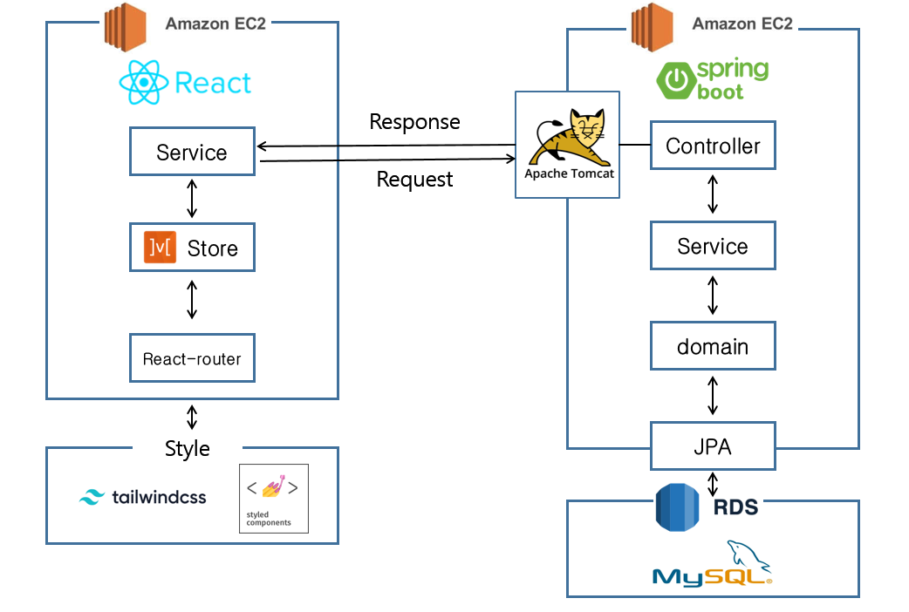

# 투두 프로젝트

## 📑 목차

- [소개](#-소개)
- [기술스택](#-기술스택)
- [아키텍처](#-아키텍처)

## 📍 소개

Todolist의 기본 기능을 갖춘 연습 프로젝트.

BackEnd : 스프링으로 컨트롤러를 구현하고 JPA를 이용해서 Database에 접근하여 구현.

FrontEnd: React를 사용하고, mobx6를 이용하여 전역상태를 관리하고 tailwindCSS와 styled component로 스타일링을 하여 구현.

## 🗂 기술스택

| 분야           | 사용 기술                                               | 비고 |
| -------------- | ------------------------------------------------------- | ---- |
| FrontEnd       | React, javascript, tailwindCSS, styled component, mobx6 |      |
| BackEnd        | Java, Spring, JPA                                       |      |
| Database       | MySQL, h2                                               |      |
| Cloud Services | AWS EC2, AWS RDS                                        |      |
| TOOL           | IntelliJ, Gradle, jUnit                                 |      |

## 🧩 아키텍처

 
